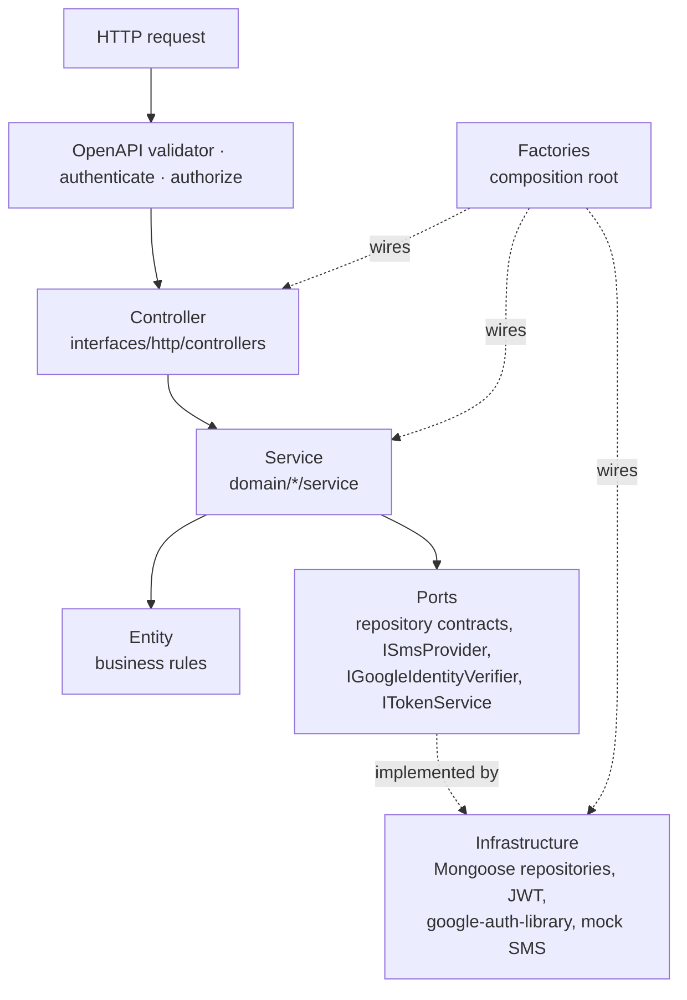
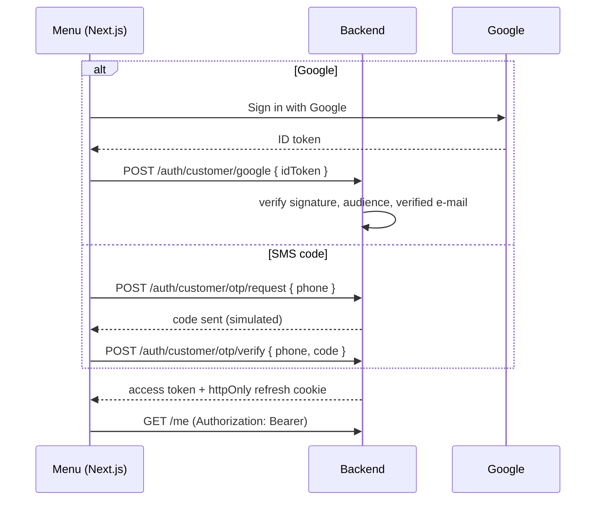

# Digital Menu — Backend

REST API for **Digital Menu**, a single-store food ordering system inspired by iFood and Quero Delivery. A restaurant publishes its menu online, customers order for delivery or pickup and follow the order live, and the store team runs everything from an admin panel.

This repository is the backend of a portfolio project. It is built with **Clean Architecture/DDD**, an **OpenAPI-first** contract validated at runtime, and **OpenTelemetry** observability.

| Repository             | Role                            | Stack                                    |
| ---------------------- | ------------------------------- | ---------------------------------------- |
| `digital-menu-backend` | REST API (this repo)            | Node.js 24, TypeScript, Express, MongoDB |
| `digital-menu`         | Customer menu (storefront)      | Next.js 16, React Query, Tailwind        |
| `digital-menu-admin`   | Store panel for owner and staff | Vite, React, Tailwind                    |

## Status

| Module                                                       | Status     |
| ------------------------------------------------------------ | ---------- |
| Customer login with **Google** or **SMS code** (simulated)   | ✅ Done    |
| Sessions: JWT access token + rotating refresh token (cookie) | ✅ Done    |
| Customer profile, contact phone and saved addresses          | ✅ Done    |
| Staff/owner accounts and login                               | 🚧 Next    |
| Store settings and opening hours                             | 📋 Planned |
| Menu: categories, products, add-ons, images                  | 📋 Planned |
| Delivery zones and coupons                                   | 📋 Planned |
| Checkout, simulated payments (Pix/card) and order tracking   | 📋 Planned |
| Real-time order updates with Socket.IO                       | 📋 Planned |

## Highlights

- **Two login methods, one account.** Customers sign in with Google or with a phone + SMS code, and can link both to the same account. SMS is simulated in the MVP: with `OTP_EXPOSE_CODE=true` the code is returned in the response, so anyone can try the demo for free.
- **Secure sessions.** Short-lived JWT access tokens (15 min) and opaque refresh tokens stored only as hashes. Every refresh rotates the token, and reusing an old one revokes the whole session family (theft detection).
- **Account takeover protection.** A phone typed in the profile is only a _contact_ phone. It becomes a login identity only after being verified by SMS, enforced by a partial unique index in MongoDB.
- **Business rules in the domain.** Typed errors carry a machine-readable `code` (`ADDRESS_LIMIT_REACHED`, `OTP_LOCKED`...) that the front ends use to show the right message.
- **Contract-first.** `src/contracts/service.yaml` (OpenAPI 3) validates every request **and** response at runtime.
- **Observability.** Structured JSON logs carry the OpenTelemetry `trace_id` on every line.
- **Tested.** Unit tests for services, entities and adapters, plus integration tests against an in-memory MongoDB. Coverage is ≥ 80% and enforced in CI.

## Architecture



- **`src/domain`** contains pure business logic: entities, services, ports, and typed errors. It never imports Express, Mongoose, or external SDKs.
- **`src/infrastructure`** holds the adapters (MongoDB repositories, JWT, Google verifier, mock SMS) and the factories that compose everything (manual DI).
- **`src/interfaces/http`** has thin controllers, auth middlewares, cookies, and presenters that shape responses.
- **Services** decorate their public methods with `@ErrorHandler()`. Domain errors pass through, and unexpected errors are logged with context and rethrown to the central error handler.

### Customer login flow



## API

The full contract lives in [`src/contracts/service.yaml`](src/contracts/service.yaml).

| Method | Path                                | Auth     | Description                                |
| ------ | ----------------------------------- | -------- | ------------------------------------------ |
| POST   | `/auth/customer/otp/request`        | —        | Send an SMS login code (simulated)         |
| POST   | `/auth/customer/otp/verify`         | —        | Log in or sign up with the code            |
| POST   | `/auth/customer/google`             | —        | Log in or sign up with a Google ID token   |
| POST   | `/auth/customer/refresh`            | cookie   | Rotate the refresh token, new access token |
| POST   | `/auth/customer/logout`             | cookie   | Revoke the session                         |
| GET    | `/me`                               | customer | Profile                                    |
| PATCH  | `/me`                               | customer | Update name and contact phone              |
| POST   | `/me/identities/google`             | customer | Link a Google account                      |
| GET    | `/me/addresses`                     | customer | List addresses                             |
| POST   | `/me/addresses`                     | customer | Add an address (max 5)                     |
| PUT    | `/me/addresses/{addressId}`         | customer | Replace an address                         |
| DELETE | `/me/addresses/{addressId}`         | customer | Remove an address                          |
| PATCH  | `/me/addresses/{addressId}/default` | customer | Set the default address                    |
| GET    | `/health`                           | —        | Health check                               |

Errors always follow the same shape:

```json
{
  "message": "A customer can save at most 5 addresses",
  "status": 422,
  "code": "ADDRESS_LIMIT_REACHED"
}
```

## Getting started

### Requirements

- Node.js **24** (`nvm use` reads `.nvmrc`)
- Yarn 1
- MongoDB. The quickest way is Docker:

```bash
docker run -d --name digital-menu-mongo -p 27017:27017 mongo:7
```

### Run

```bash
yarn install
cp .env.example .env
```

In `.env`, set `JWT_ACCESS_SECRET` and `OTP_PEPPER` to long random strings (`openssl rand -base64 48`). Set `GOOGLE_CLIENT_ID` to a Google OAuth Web client ID; any placeholder works if you only test SMS login. Then start the API:

```bash
yarn dev
```

The API runs on `http://localhost:3000`.

### Try it

```bash
# 1. Request a code (simulated SMS: the code comes back as debugCode)
curl -s -X POST localhost:3000/auth/customer/otp/request \
  -H 'Content-Type: application/json' -d '{"phone":"(11) 99999-8888"}'

# 2. Log in with the code (the refresh token is set as a cookie)
curl -s -c cookies.txt -X POST localhost:3000/auth/customer/otp/verify \
  -H 'Content-Type: application/json' -d '{"phone":"11999998888","code":"<debugCode>"}'

# 3. Use the access token
curl -s localhost:3000/me -H 'Authorization: Bearer <accessToken>'

# 4. Refresh the session with the cookie
curl -s -b cookies.txt -c cookies.txt -X POST localhost:3000/auth/customer/refresh
```

### Environment variables

| Variable                    | Required | Description                                                         |
| --------------------------- | -------- | ------------------------------------------------------------------- |
| `PORT`                      | no       | HTTP port (default `3000`)                                          |
| `DATABASE_URI`              | yes      | MongoDB connection string                                           |
| `JWT_ACCESS_SECRET`         | yes      | Secret used to sign access tokens                                   |
| `JWT_ACCESS_TTL_SECONDS`    | no       | Access token lifetime (default `900`)                               |
| `REFRESH_TTL_CUSTOMER_DAYS` | no       | Customer refresh token lifetime (default `30`)                      |
| `REFRESH_TTL_STAFF_DAYS`    | no       | Staff refresh token lifetime (default `7`)                          |
| `COOKIE_DOMAIN`             | no       | Parent domain shared with the front ends in production              |
| `OTP_PEPPER`                | yes      | Server secret mixed into the SMS code hashes                        |
| `OTP_EXPOSE_CODE`           | no       | `true` returns the simulated SMS code (demo only)                   |
| `GOOGLE_CLIENT_ID`          | yes      | Google OAuth client ID used to verify ID tokens                     |
| `OTEL_*`                    | no       | OpenTelemetry settings (see [observability](docs/observability.md)) |

## Scripts

| Command              | What it does                                              |
| -------------------- | --------------------------------------------------------- |
| `yarn dev`           | Start with hot reload                                     |
| `yarn build`         | Compile to `dist/` and copy the OpenAPI contract          |
| `yarn start`         | Run the compiled build                                    |
| `yarn test`          | Unit + integration tests                                  |
| `yarn test:coverage` | Tests with the merged 80% coverage threshold (used in CI) |
| `yarn lint`          | ESLint                                                    |
| `yarn prettier`      | Format the code                                           |

Integration tests use `mongodb-memory-server`, so no local MongoDB is needed to run them.

## Project structure

```text
src/
├── contracts/service.yaml        # OpenAPI contract (validates requests and responses)
├── domain/
│   ├── auth/                     # sessions, tokens, customer login orchestration
│   ├── customer/                 # customer entity, addresses, profile rules
│   ├── otp/                      # SMS codes, throttling, attempts
│   ├── common/                   # clock port, phone normalization, @ErrorHandler()
│   ├── errors/                   # typed domain errors mapped to HTTP
│   └── ...                       # interfaces of the upcoming modules (store, product, order...)
├── infrastructure/
│   ├── config/                   # env (fail-fast) and factories (composition root)
│   ├── db/mongo/                 # Mongoose schemas and models
│   ├── repository/               # repository implementations
│   ├── security/                 # JWT, OTP hashing, Google ID token verifier
│   ├── sms/                      # simulated SMS provider
│   └── telemetry/                # OpenTelemetry and trace-correlated logs
├── interfaces/http/              # server, controllers, middlewares, cookies, presenters
└── __tests__/                    # unit and integration tests
```

## Documentation

- [docs/architecture.md](docs/architecture.md): layers, request flow, dependency injection
- [docs/conventions.md](docs/conventions.md): naming and code patterns
- [docs/testing.md](docs/testing.md): testing strategy
- [docs/observability.md](docs/observability.md): OpenTelemetry and structured logs
- [CLAUDE.md](CLAUDE.md): guide for AI-assisted contributions

## Author

Built by **Gabriel Santana** as a portfolio project.
