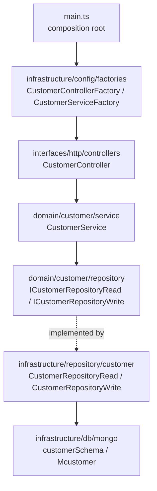

# Architecture

## Overview

Clean Architecture with vertical slices per feature. The `customer` slice is the
canonical example — every new feature must mirror it file by file.



**Dependency rule:** `domain/` is pure — it does not import `infrastructure/`
or `interfaces/`. Repository contracts live in the domain
(`src/domain/customer/repository/customer.repository.read.ts` → `ICustomerRepositoryRead`);
implementations live in infrastructure
(`src/infrastructure/repository/customer/customer.repository.read.ts` → `CustomerRepositoryRead`).
The **file names are identical** on both sides — the directory distinguishes
contract from implementation. Do not mix them up when editing.

## Read/write split (light CQRS)

Each feature has two repository contracts:

- `I<Feature>RepositoryRead` — `findCustomerById`, `findCustomerByVerifiedPhone`, `findCustomerByGoogleSub`
- `I<Feature>RepositoryWrite` — `createCustomer`, `updateCustomerById`

The service receives both via a parameter object:

```ts
export class CustomerService implements ICustomerService {
  private customerRepositoryRead: ICustomerRepositoryRead;
  private customerRepositoryWrite: ICustomerRepositoryWrite;

  constructor({ customerRepositoryRead, customerRepositoryWrite }: IParamsCustomerService) {
    this.customerRepositoryRead = customerRepositoryRead;
    this.customerRepositoryWrite = customerRepositoryWrite;
  }
}
```

## Dependency injection

Manual DI, no container. Static factories in
`src/infrastructure/config/factories/`, one per artifact, with a `static create()`:

```ts
// customer.service.factory.ts
export class CustomerServiceFactory {
  static create() {
    return new CustomerService({
      customerRepositoryRead: new CustomerRepositoryRead(),
      customerRepositoryWrite: new CustomerRepositoryWrite(),
    });
  }
}

// customer.controller.factory.ts
export class CustomerControllerFactory {
  static create(): IController {
    return new CustomerController(CustomerServiceFactory.create());
  }
}
```

Rules:

1. All composition happens in factories — never inside services/controllers.
2. Factories do **no I/O at module load**; side effects only inside `create()`.
3. `main.ts` only knows controller factories.

## Server lifecycle (`src/interfaces/http/server.ts`)

Initialization order in the `Server` constructor:

1. `/health` route (registered **before** the middlewares — which is why it escapes the OpenApiValidator).
2. Middlewares: `express.json({ limit: '3mb' })` → `express.urlencoded` →
   `ContextAsyncHooks.getExpressMiddlewareTracking()` (traceability cid) → `helmet()` →
   extra middlewares passed via `middlewaresToStart` in the constructor.
3. `OpenApiValidator.middleware` with `validateApiSpec: true` and `validateResponses: true`.
4. Controller routes (`controller.getRoutes()` mounted at `/`).
5. **Central error handler** (`errorHandler()`): the only place that translates
   errors into HTTP responses — `DomainError` → `err.status` + `{ message, status }`;
   validator `HttpError` → `{ message, status, errors }`; generic `Error` →
   structured log + 500 `{ message: 'Internal Server Error', status: 500 }`.

In `main.ts`, the boot order is: telemetry (first-line import) → env validation
(`infrastructure/config/env.ts`, fail-fast) → `new Server(...)` →
`await databaseSetup()` → `listen()` → graceful-shutdown registration
(SIGTERM/SIGINT close the HTTP server and Mongoose, exit 0 on success, with a
failsafe timeout).

## Domain errors (`src/domain/errors/`)

`DomainError` (base, carries the HTTP `status`) and the specializations
`NotFoundError` (404) and `ConflictError` (409). The error flow is always:
service throws a typed error → controller passes it on with `next(error)` →
central error handler responds in the contract shape. No other layer builds
error responses.

## Request→response flow (example: `POST /me/addresses`)

1. `express.json` and `cookie-parser` parse the request; `ContextAsyncHooks` creates the tracking context (cid); OTel auto-instrumentation opens the HTTP span.
2. `OpenApiValidator` validates the request (and the `bearerAuth` header) against `src/contracts/service.yaml` — an invalid body → 400 `ValidationError` before reaching the controller.
3. `authenticate` verifies the access token and sets `req.auth`; `authorize({ subjectType: CUSTOMER })` blocks other subjects with 403.
4. `CustomerController.addAddress` (arrow function property) extracts the address from the body and calls `customerService.addAddress(...)`.
5. `CustomerService.addAddress` (decorated with `@ErrorHandler()`) loads the customer, resolves the delivery zone through the `IDeliveryZoneResolver` port and lets the `Customer` entity apply the address rules (limit of 5 → `BusinessRuleError` 422).
6. `CustomerRepositoryWrite` persists via the `Mcustomer` model and returns a plain `ICustomer` (projection hides `_id`/`__v` — see `mongo.projection.ts`).
7. The controller responds `201` with the address shaped by `customer.presenter.ts`; any error goes to `next(error)`.
8. `OpenApiValidator` validates the **response** against the contract before sending it.

## OpenAPI contract (`src/contracts/service.yaml`)

- Source of truth for the API; validated at runtime in both directions.
- Every route/payload change **requires** updating the yaml in the same PR.
- The build copies the yaml to `dist/src/contracts` via the `copy-essentials`
  script (tsc does not copy non-TS files). Without it, `yarn start` breaks.
- Routes not documented in the contract are rejected by the validator.

## Entry points

| File | Role |
| --- | --- |
| `src/main.ts` | Production/dev: telemetry + `Server` + controllers via factories |
| `src/__tests__/configApp.ts` | `Server` instance used by integration tests — **must register the same controllers** |
